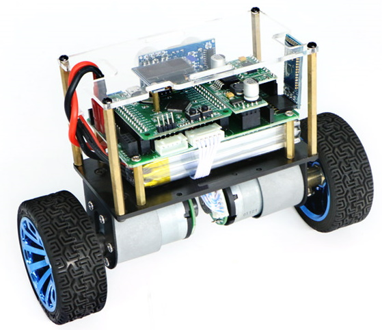
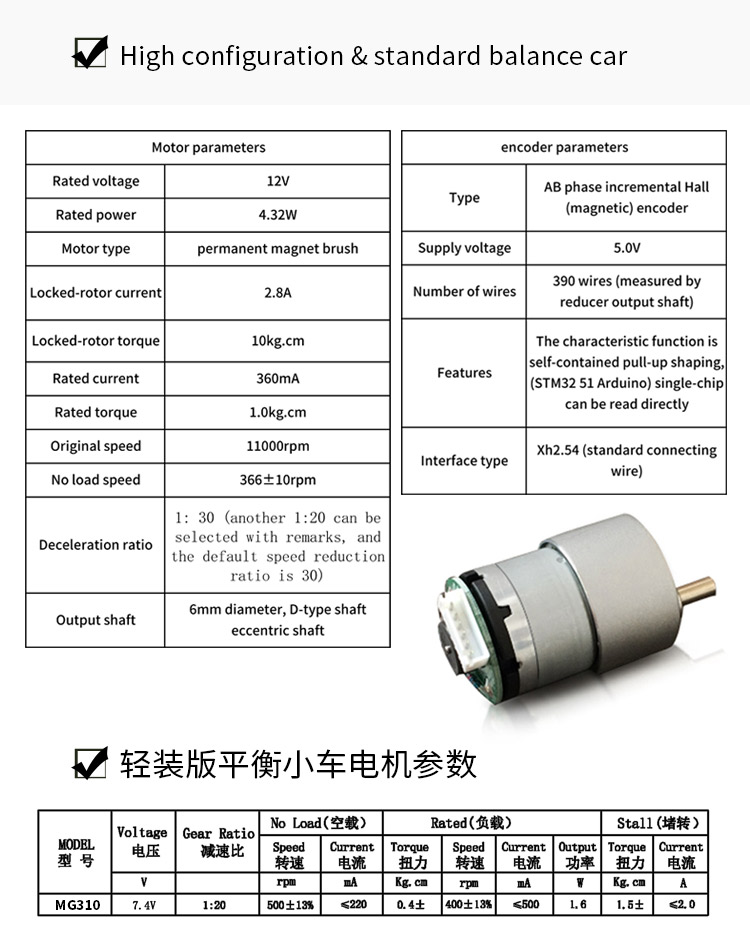

# pid-balancecar
Code, usage notes for operation of an STM32-controlled "self-balancing car", as shown below:

There are several similar models available from different suppliers on AliExpress, BangGood etc.

## Operation
- Long press on USER button: toggle operation mode
  - "putong" (普通) = "ordinary" (i.e. static balance)
  - "bizhang" (蔽障) = "obstacle" (i.e. moves to avoid obstacles placed in front of ultrasonic sensor)
 - Short press on USER button: start/stop balancing
 
## Hardware
- 2x [MG513P3012V](https://www.aliexpress.com/item/4000996252848.html) Motors, 30:1 gear ratio

